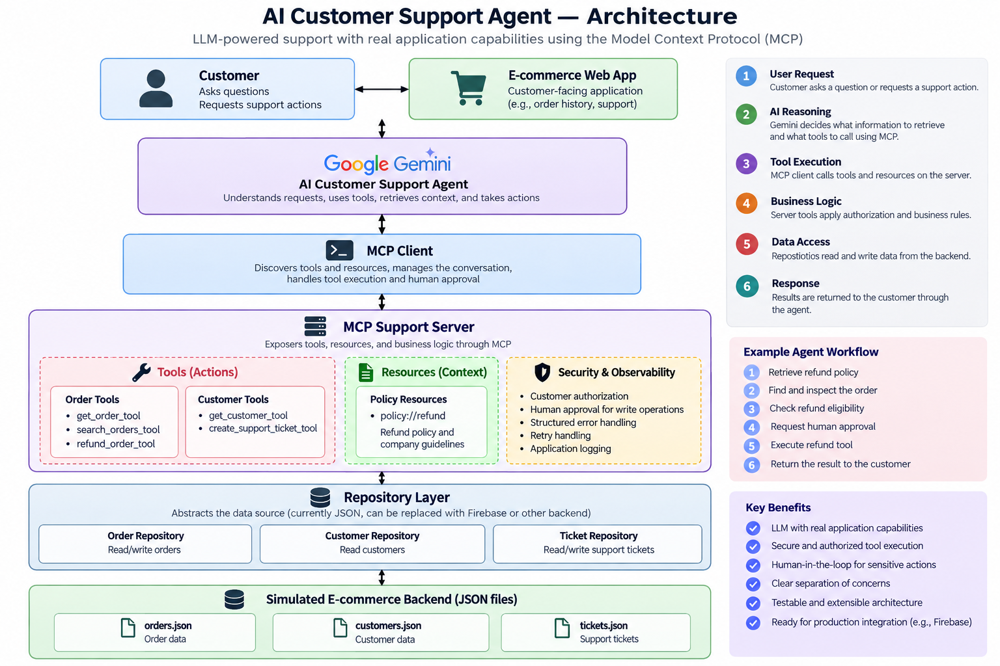

# AI Customer Support Agent — MCP + Gemini

An AI-powered customer support agent for an e-commerce platform, built with **Google Gemini** and the **Model Context Protocol (MCP)**.

The agent can investigate customer orders, retrieve company policies, answer support questions, and execute approved support actions through MCP tools.

The current implementation uses a simulated JSON backend. The repository layer is designed so the backend can later be replaced with Firebase or production APIs.

---

## Architecture



```text
Customer
   │
   ▼
E-commerce Web App
   │
   ▼
AI Customer Support Agent
   │
   │ Gemini
   ▼
MCP Client
   │
   │ MCP
   ▼
MCP Support Server
   │
   ├── Order Tools
   │     ├── get_order_tool
   │     ├── search_orders_tool
   │     └── refund_order_tool
   │
   ├── Customer Tools
   │     ├── get_customer_tool
   │     └── create_support_ticket_tool
   │
   └── Policy Resources
         └── policy://refund
   │
   ▼
Repository Layer
   │
   ├── Order Repository
   ├── Customer Repository
   └── Ticket Repository
   │
   ▼
Simulated E-commerce Backend
   │
   ├── orders.json
   ├── customers.json
   └── tickets.json
```

---

## What This Project Demonstrates

This project demonstrates how an LLM can interact with real application capabilities through MCP rather than only generating text.

The agent can:

```text
Understand customer request
        ↓
Retrieve trusted application context
        ↓
Determine required tools
        ↓
Call MCP tools
        ↓
Process tool results
        ↓
Request human approval for write actions
        ↓
Execute approved action
        ↓
Return result to customer
```

---

## Key Features

### MCP Tool Integration

The MCP server exposes application capabilities as tools.

#### Order Tools

* `get_order_tool` — retrieve an order
* `search_orders_tool` — retrieve orders belonging to the authenticated customer
* `refund_order_tool` — request a refund

#### Customer & Support Tools

* `get_customer_tool` — retrieve customer information
* `create_support_ticket_tool` — create a support ticket

The Gemini agent receives the available MCP tool schemas and decides when a tool is required.

---

### MCP Resources

Company policies are exposed through MCP resources.

Current resource:

```text
policy://refund
```

The agent retrieves the refund policy and uses it as trusted application context when handling refund requests.

Example policy:

```text
Customers can request a refund within 30 days of purchase.

Digital products cannot be refunded after download.

Refund requests require a valid order ID.
```

This separates company knowledge from the model's general knowledge.

---

### Multi-Step Agent Workflow

A refund request can involve multiple steps:

```text
Customer requests refund
        ↓
Retrieve refund policy
        ↓
Check order
        ↓
Verify customer authorization
        ↓
Evaluate business rules
        ↓
Request human approval
        ↓
Execute refund_order_tool
        ↓
Return result
```

This demonstrates an agent loop where the model can use information from one operation to determine the next operation.

---

### Human-in-the-Loop Approval

Potentially consequential operations require explicit human approval.

Write operations currently include:

```text
refund_order_tool
create_support_ticket_tool
```

Example:

```text
⚠️ Approval required

Action: refund_order_tool
Arguments: {"order_id": "ORD-1001"}

Approve this action? (yes/no)
```

Read-only operations can execute without this approval step.

---

### Customer Authorization

The system uses an authenticated customer context:

```env
AUTHENTICATED_CUSTOMER_ID=CUS-101
```

Tools verify that the requested customer or order belongs to the authenticated customer.

For example, an authenticated customer with:

```text
CUS-101
```

cannot retrieve or refund an order belonging to:

```text
CUS-102
```

Unauthorized operations return structured errors instead of exposing another customer's data.

Example:

```json
{
  "success": false,
  "error_type": "authorization",
  "message": "You are not authorized to refund this order."
}
```

---

### Structured Error Handling

Tool failures are represented using structured error types such as:

```text
not_found
authorization
business_rule
```

Example:

```json
{
  "success": false,
  "error_type": "business_rule",
  "message": "Refund has already been requested."
}
```

This allows the agent and client to distinguish between different failure conditions.

---

### Retry Handling

The MCP client includes retry handling for tool failures while avoiding inappropriate repeated execution of authorization-sensitive operations.

This prevents deterministic authorization or business-rule failures from being repeatedly retried.

---

### Observability

Application events are recorded using Python logging.

Examples include:

```text
REFUND_REQUESTED
REFUND_REJECTED
REFUND_SUCCESS
AUTHORIZATION_FAILED
ORDER_NOT_FOUND
```

Logs are written to:

```text
logs/agent.log
```

The log directory is excluded from version control.

---

### Repository Layer

Application business logic is separated from data persistence:

```text
MCP Tool
   ↓
Business Logic
   ↓
Repository
   ↓
Storage
```

The current implementation uses JSON files:

```text
orders.json
customers.json
tickets.json
```

The repository abstraction allows the storage implementation to be replaced later without changing the MCP tool interface.

For example:

```text
Current:

MCP Tool
   ↓
Repository
   ↓
JSON
```

```text
Future:

MCP Tool
   ↓
Repository
   ↓
Firebase / Production API
```

---

## Testing

The project includes automated tests using `pytest`.

Tests currently cover:

* Authorized order access
* Unauthorized order access
* Unknown orders
* Customer-specific order searches
* Repository order lookup
* Repository customer filtering
* Repository updates
* Isolated temporary test data

Run the test suite with:

```bash
python -m pytest
```

The repository tests use temporary data so test execution does not modify the application's actual simulated backend.

---

## Project Structure

```text
mcp-ecommerce-agent/
│
├── client/
│   └── client.py
│
├── server/
│   ├── __init__.py
│   ├── server.py
│   ├── auth.py
│   ├── logging_config.py
│   │
│   ├── tools/
│   │   ├── __init__.py
│   │   ├── order_tools.py
│   │   └── customer_tools.py
│   │
│   ├── repositories/
│   │   ├── __init__.py
│   │   ├── order_repository.py
│   │   ├── customer_repository.py
│   │   └── ticket_repository.py
│   │
│   └── resources/
│       ├── __init__.py
│       └── policy_resources.py
│
├── data/
│   ├── orders.json
│   ├── customers.json
│   └── tickets.json
│
├── policies/
│   └── refund_policy.md
│
├── logs/
│   └── agent.log
│
├── tests/
│   ├── test_order_tools.py
│   └── test_order_repository.py
│
├── .env
├── .gitignore
├── requirements.txt
└── README.md
```

---

## Technology Stack

* **Python**
* **MCP SDK v2**
* **Google Gemini**
* **Gemini Interactions API**
* **MCP tools**
* **MCP resources**
* **pytest**
* **python-dotenv**
* JSON-based simulated backend

---

## Running the Project

### 1. Clone the repository

```bash
git clone <your-repository-url>
cd mcp-ecommerce-agent
```

### 2. Create a virtual environment

```bash
python -m venv .venv
```

Windows PowerShell:

```powershell
.venv\Scripts\Activate.ps1
```

### 3. Install dependencies

```bash
pip install -r requirements.txt
```

### 4. Configure environment variables

Create a `.env` file:

```env
GEMINI_API_KEY=your_key_here
AUTHENTICATED_CUSTOMER_ID=CUS-101
```

Do not commit `.env` or your API key to GitHub.

### 5. Run the agent

```bash
python client/client.py
```

### 6. Run tests

```bash
python -m pytest
```

---

## Example Interaction

Customer:

```text
I want a refund for my wireless headphones.
```

The agent can perform the following workflow:

```text
1. Retrieve refund policy
2. Identify the relevant order
3. Check order details
4. Verify customer authorization
5. Evaluate refund conditions
6. Request human approval
7. Execute refund_order_tool
8. Return the result
```

Example tool result:

```text
Gemini wants to call:
get_order_tool

MCP returned:

{
    "success": true,
    "order": {
        "order_id": "ORD-1001",
        "status": "shipped",
        "amount": 1200
    }
}
```

Before the refund action:

```text
⚠️ Approval required

Action: refund_order_tool
Arguments: {"order_id": "ORD-1001"}

Approve this action? (yes/no)
```

---

## Current Scope

The current project intentionally uses simulated e-commerce data:

```text
data/
├── orders.json
├── customers.json
└── tickets.json
```

This keeps the MCP and agent architecture easy to develop and test without requiring access to production customer data.

---

## Future Production Integration

The planned production architecture is:

```text
Customer
   ↓
Existing E-commerce Application
   ↓
AI Customer Support Agent
   ↓
MCP Client
   ↓
MCP Support Server
   ↓
Repository Layer
   ↓
Firebase / Production APIs
```

Potential future capabilities include:

* Firebase integration
* Real authenticated customer sessions
* Product and catalog knowledge retrieval
* Order tracking APIs
* Return workflows
* Refund provider integration
* Persistent support tickets
* Production monitoring and tracing
* Docker deployment
* Integration with the existing e-commerce application

---

## Why MCP?

A traditional LLM application might connect model-generated responses directly to application APIs.

This project instead uses MCP as a standardized capability layer:

```text
LLM
 ↓
MCP Client
 ↓
MCP Server
 ↓
Application Capabilities
```

The MCP server exposes tools and resources in a structured way, allowing the AI agent to discover and use application capabilities without embedding all application-specific operations directly into the model layer.

---

## Engineering Concepts Demonstrated

This project combines several practical GenAI engineering concepts:

* Model Context Protocol
* LLM function calling
* Agentic tool use
* Multi-step tool execution
* MCP resources
* Human-in-the-loop workflows
* Authorization
* Structured errors
* Retry handling
* Application logging
* Repository pattern
* Automated testing
* Separation of concerns
* Extensible backend architecture

---